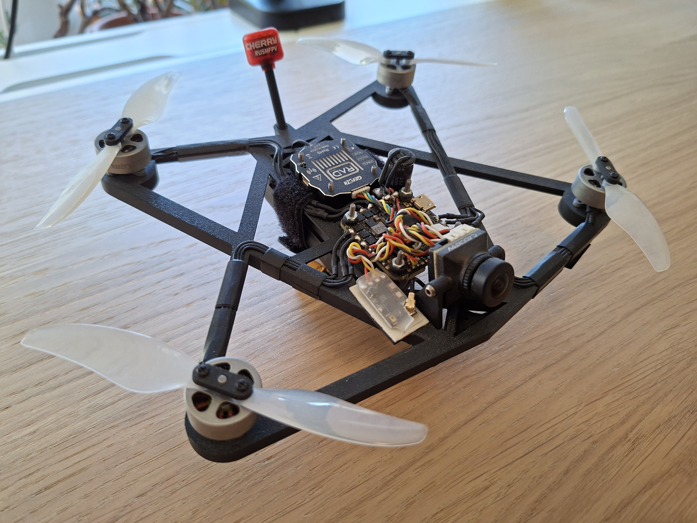
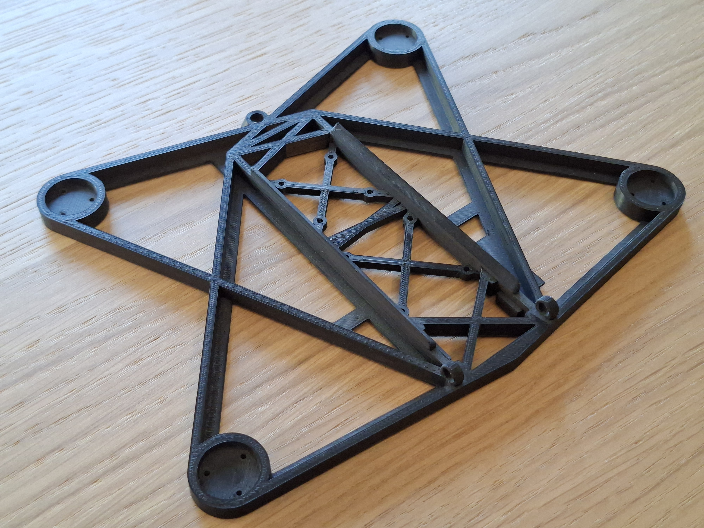

# PAVATA-Project

## Goal of the project - SUCCESSED
The goal of the project is to make a sub 250g FPV Drone with custom 3D printed frame with analog video system, long flight time, hight video and radio link range and affordable price.

## Frame
Drone uses custom frame project made in Autodesk Fusiun and 3D printed on Prusa i3MK3S+ from ASA material. Frame is based on dead-cat shape with multiple triangle based porters. Thanks to it frame is stiff and light. 

## Flight Controller System
Drone uses GEPRC GEP-F722-45A AIO V2, which is single board flight controller with STM32F722 MCU, four 45A continuous current ESC and weight of olny 8.8g. 

## Power Supply
To achive long fly time drone is powered with custom Li-ion 18650 2S pack made with high current Molicel INR 18650 - P28A 2800mAh cells. 

## Motors
Because of high efficiency, small weight and affordable price I choose DarwinFPV 1504-3800KV BLDC motors with 2 blade 4 inch GEMFAN 4019 propellers. Unfortunately the was need of designing custom 3D printed holders to connect them to choosen BLDC motors.

## Radio link
As the radio link quadrocopter uses open source, super high range ExpressLRS 2.4GHz protocol. Thanks to it drone can be controlled with multiple popular controllers with high prize ranges - from affordable to proffesional.

## Video system
Analog video system was choosen because of open-source technology supported by lot of vendors, high range link with good receiver and super affordable price. I combined GEPRC RAD 1W Video Transmitter with RUSHFPV Cherry II 5.8GHz RHCP 1.8dbi antenna and Caddx Ratel 2 Micro camera to achive long video transmission range with keepeng drone ultra light.

## Future Improvment
I want to add M10 GPS for autonomous flight modes and Return-To-Home failsave rescue. It communicates with Flight Controller via uart.